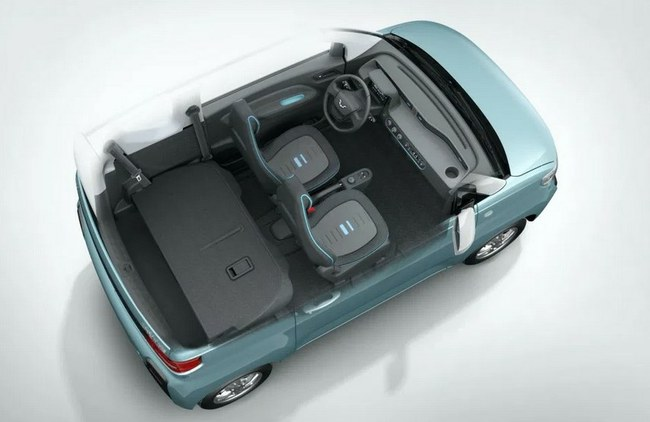

Jei jau užsigeidėte šio automobilio ir pradėjote daužyti taupyklę – neskubėkite. Deja, bet šis elektromobilis kol kas pardavinėjamas tik Kinijoje. Yra planų dėl plėtros į Indoneziją ir Indiją.

Pastaraisiais metais Kinijoje tokie mini elektromobiliai tapo labai populiarūs. Ir čia turime dar vieną tokį modelį.

„GM“ drauge su „SAINC“ sukūrė „Wuling Hongguang MINI“ elektromobilį, kurio kaina prasideda vos nuo 4000 dolerių ir maksimalios komplektacijos automobilis kainuoja 5500 dolerių.

Ir kaip praneša „Gasgoo“, nuo pasirodymo praėjus vos 20 dienų – šių mažų elektromobilių Kinijoje parduota 15 000 vnt., ir sulaukta dar 50 000 užsakymų.

„Nuo liepos 24 d., kai Chengdu Motor Show buvo pristatytas Wuling Hongguang MINI elektromobilis, vos per 20 dienų juos įsigijo 15 000 pirkėjų. Pirmieji 10 000 vienetų buvo parduoti labai greitai. Tiesą sakant, per pirmąją pardavimų savaitę jų parduota 7 346. Per visą šį laiką naująjį elektromobilį užsisakė 50 000 klientų“, - rašo „Gasgoo“.

Žinoma, už Kinijos sienų tokie kompaktiški „kibiriukai“ kol kas nėra tokie populiarūs, bet laikai keičiasi.

Žmonės į transporto priemonę pradeda vis labiau žiūrėti, kaip į daiktą, leidžianti patogiai ir greitai nuvykti į norimą vietą, o ne kaip bandymą parodyti savo (ne)esamą socialinį statusą.

O ir ekologinis sąmoningumas bei, pripažinkime, mada, daro savo įtaką ir vis daugiau jaunų žmonių nori elektromobilio.

Štai ir kitas Kinijos elektromobilių gamintojas „Kandi“ siūlo amerikiečiams – itin galingų ir didelių automobilių mėgėjams – kompaktiškus elektromobilius vos nuo 13 000 dolerių.

Ir tikėdamas savo sėkme, visai neseniai pranešė, kad planuoja JAV statyti tokių elektromobilių gamyklą. Laikai keičiasi, kaip ir žmonių požiūris į transporto priemones.

**technologijos.lt**

<iframe width="560" height="315" src="https://www.youtube.com/embed/Cdi2dBOqBUY" frameborder="0" allow="accelerometer; autoplay; encrypted-media; gyroscope; picture-in-picture" allowfullscreen></iframe>