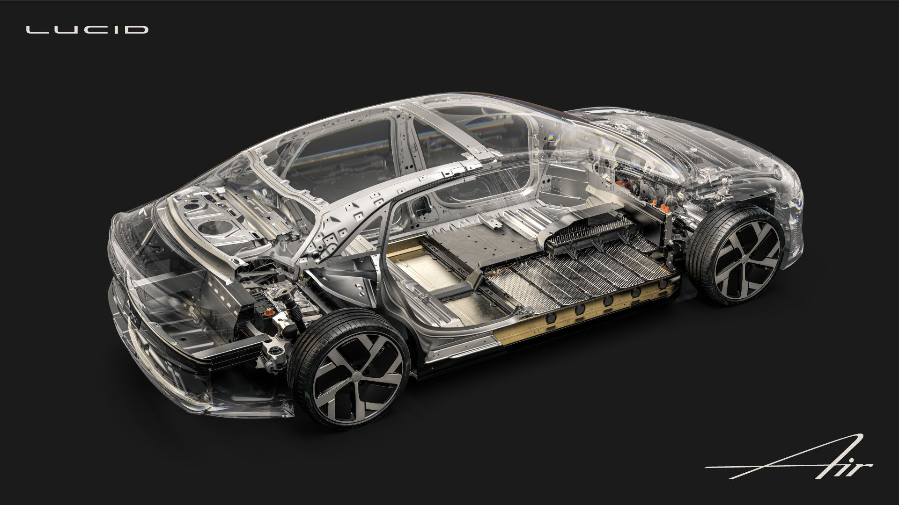
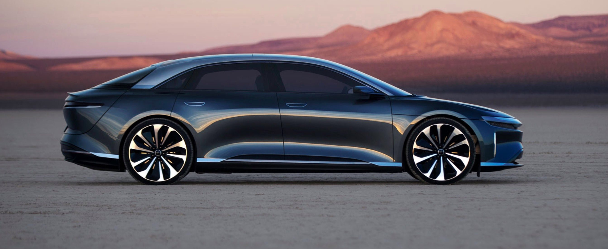

Prieš savaitę „Lucid“ paviešino „Lucid Air“ elektromobilio testavimo rezultatus ir buvo nustatyta, kad vienu įkrovimu naujasis elektromobilis gali nuvažiuoti 517 mylių arba 832 km. Tai yra pats geriausias rezultatas pasaulyje.

Dabar „Lucid“ kompanija [tvirtina](https://lucidmotors.com/), kad „Lucid Air“ elektromobiliui priklausys ir dar vienas geriausias rezultatas pasaulyje – baterijų įkrovimo greitis.

Žinia, kad daugelį elektromobilių pirkėjų atbaido baterijų įkrovimo greitis. Nors šioje srityje pastebimas ženklus progresas ir nuolat auga greitąjį elektromobilių įkrovimą palaikančių įkrovimo stotelių skaičius, tačiau dažniausiai įkrovimo procesas yra ilgesnis, nei įprasto automobilio kuro bako papildymas.

Ką gi, „Lucid“ tvirtina, kad su jų naujuoju elektromobiliu bus galima pamiršti tokius pasiteisinimus. Kompanija pristatė 900 voltų įkroviklį, palaikantį įspūdingą 300 kW įkrovimą.

„Lucid Air bus greičiausiai pasaulyje įkraunamas elektromobilis ir per vieną minutę baterijos bus įkrautos tiek, kad bus galima nuvažiuoti 20 mylių (32,2 km aut. past.), o per 20 minučių – 300 mylių (482,8 km aut. past.)“, - teigia „Lucid“ kompanija.

Prisiminkime, kad „Tesla“ trečios kartos ir greitąjį įkrovimą palaikantis „Supercharger“ tinklas maksimaliai palaiko 250 kW.

„Lucid“ tvirtina, kad jų įkrovimo technologija turės „pilną sąveiką su viešąja įkrovimo infrastruktūra, įskaitant esamus ir naujai šalyje (JAV aut. past.) įrengiamus 350 kW įkrovimo taškus“.

Be to, padedant „Volkswagen“ dukterinei įmonei „Electrify America“, JAV bus sukurtas atskiras greitąjį elektromobilių įkrovimą palaikantis tinklas, kuris remsis kombinuotos įkrovimo sistemos (CCS) standartu.

Taip pat kompanija tvirtina, kad asmeniniam naudojimui „Lucid Air“ elektromobilius įsigijusieji galės viešose įkrovimo stotelėse juos nemokamai įkrauti trejus metus.

„Lucid“ teigia, kad jie pirmieji pasaulyje pirkėjams pasiūlys namuose įrengiamą dvikryptę įkrovimo stotelę. Tai reiškia, kad „Lucid Air“ elektromobilį ne tik bus galima įkrauti savo namuose, bet ir panaudoti elektromobilio energiją, kai tik į namus nutrūks elektros tiekimas. „Tai bus tarsi didžiulė baterija“, - teigia „Lucid“ kompanija.

Čia verta pažymėti, kad namuose bus palaikomas vienas geriausių rinkoje 19,2 kW (AC) elektromobilio įkrovimo rodiklių. Kas reiškia, jog per 1 val. „Lucid Air“ baterijos bus įkrautos tiek, kad bus galima nuvažiuoti 80 mylių arba 129 km.

<iframe width="560" height="315" src="https://www.youtube.com/embed/tMPOUFkRSfY" frameborder="0" allow="accelerometer; autoplay; encrypted-media; gyroscope; picture-in-picture" allowfullscreen></iframe>

Be nuostabaus nuvažiuojamu atstumo ir įspūdingai greito baterijų įkrovimo, „Lucid Air“ pasižymi ir kitomis puikiomis specifikacijomis, įskaitant 1000 AG, nuo 0 iki 60 mylių per valandą (96,5 km/h) įsibėgėja per 2,5 sek., o maksimalus greitis yra didesnis nei 320 km/h.

Gamintojas taip pat žada, kad „Lucid Air“ atkeliaus su trečią lygį atitinkančia vairavimo patirtį gerinančia sistema. „Lucid Air“ turės 32 jutiklius ir pasiūlys 19 vairavimą palengvinančių funkcijų.

Dabar elektromobilių mėgėjai su nekantrumu laukia šių metų rugsėjo 9 dienos. Gamintojas ruošia internetinį premjeros renginį ir tądien bus oficialiai pristatytas „Lucid Air“ elektromobilis bei kitos su juo susijusios detalės.

**technologijos.lt**

<iframe width="560" height="315" src="https://www.youtube.com/embed/jbXEWi-OK4o" frameborder="0" allow="accelerometer; autoplay; encrypted-media; gyroscope; picture-in-picture" allowfullscreen></iframe>