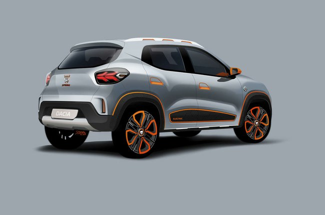

Nepaisant to, „Dacia Spring“ yra įdomus elektromobilis iš markės, kuri įprastai gamina itin pigius, bet praktiškus automobilius. Kaip ir buvo tikėtasi, pirmasis „Dacia“ elektromobilis buvo sukurtas „Renault City K-ZE“ elektrinio krosoverio pagrindu. Pastarasis automobilis yra labiau skirtas Kinijos rinkai, tačiau „Spring“ keliaus į Europą. Kaip žinote, „Renault“ yra „Dacia“ prekės ženklo savininkė. Šios markės yra labai glaudžiai susijusios ir net persipynusios. „Renault“ vardu mūsų kraštuose žymimi aukštesnės klasės automobiliai, o „Dacia“ - ant senesnių platformų sukurtos labai pigios mašinos. Tuo tarpu Pietų Amerikos keliais važinėja „Renault Duster“ ir „Renault Sandero“ automobiliai.

Deja, bet kol kas apie „Spring“ žinome labai mažai. Automobilis turėtų būti parduodamas nuo kitų metų. Jis turi LED žibintus, kurie turėtų padėti tausoti baterijų energiją, naują „Dacia“ grotelių dizainą (grotelės, žinoma, čia yra tik papuošimas) ir gana aukštą važiuoklę.

Baterijos yra brangiausia elektromobilio dalis ir „Spring“ turės gana nedidelį baterijų paketą. Kokį - neatskleidžiama, tačiau tikriausiai 26,8 kWh, nes tiek energijos gali saugoti „Renault City K-ZE“ elementai.

„Renault“ giriasi, kad „City K-ZE“ vienu įkrovimu gali įveikti 271 km, tačiau šis rodiklis apskaičiuotas naudojant seną NEDC ciklo standartą. Tuo tarpu „Dacia“ teigia, kad „Spring“ tarp įkrovimų nuvažiuos daugiau nei 200 km. Tai - kur kas realistiškesnis rodiklis, tačiau panašu, kad „Spring“ toli už miesto ribų neišvažiuos.

Maždaug tiek informacijos kol kas žinome. „Spring“ yra pirmasis „Dacia“ elektromobilis, tačiau jų tikrai bus daugiau. Kiek „Spring“ gali kainuoti? Kol kas nežinoma, tačiau „Renault City K-ZE“ Kinijoje kainuoja 61800 juanius - mažiau nei 8000 eurų (skaičiuojant po valstybės paramos). „Spring“ yra labai panašus į „City K-ZE“ - techniškai tai yra identiški automobiliai. Tačiau europiečiai turi daugiau pinigų, čia galioja kitokie standartai, todėl „Spring“ bus brangesnis. Bet kuriuo atveju, jis turi puikius šansus tapti pigiausiu elektromobiliu Europoje.

<iframe width="560" height="315" src="https://www.youtube.com/embed/m_wQMo50HRk" frameborder="0" allow="accelerometer; autoplay; encrypted-media; gyroscope; picture-in-picture" allowfullscreen></iframe>